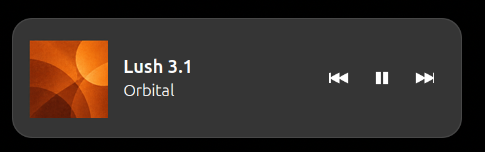

<div align="center">

# 🎧 Corner Player for Spotify

**A tiny Spotify controller that slides out from either bottom corner of GNOME Shell.**




</div>

Push the pointer against the selected lower screen edge to reveal the current
track and controls. Move away and the player hides again, like an auto-hidden
dock.

## Features

- Lower-left or lower-right reveal edge
- Previous, play/pause, and next controls through MPRIS
- Live title, artist, artwork, and playback state
- Top-bar menu for on/off, screen side, and session dismissal
- Click the artwork to bring Spotify to the front
- English interface with automatic Brazilian Portuguese translation
- No daemon, Spotify Web API, login, telemetry, or extra runtime dependency
- Automatically follows Spotify and stays out of fullscreen apps

## Compatibility

- GNOME Shell 50
- Spotify desktop client exposing `org.mpris.MediaPlayer2.spotify`
- Tested on Ubuntu 26.04, Wayland, and GNOME Shell 50.1

Only GNOME 50 is declared because it is the version currently tested.

## Install

The GNOME Extensions link will be added after the first version is approved.

For a local installation:

```bash
sudo apt install gnome-shell-extensions
git clone https://github.com/Bernardik226/spotify-corner-player-gnome.git
cd spotify-corner-player-gnome
./install.sh
```

Log out and back in once, then start Spotify. Use `./uninstall.sh` to disable
the extension and move its local files to the desktop trash.

## Use

1. Start Spotify.
2. Push the pointer against the selected lower corner.
3. Move away to hide the player.
4. Use the top-bar icon to toggle the widget, select the side, or choose
   **Exit**.

**Exit** dismisses only the widget for the current Spotify session. It does
not close Spotify or uninstall the extension.

## Development

```bash
gjs -m tests/playerState.test.js
gjs -m tests/mpris.test.js
bash tests/i18n.test.sh
glib-compile-schemas --strict --dry-run schemas
```

## License

[GPL-3.0](LICENSE). Spotify is a trademark of Spotify AB. This independent
project is not affiliated with or endorsed by Spotify.
